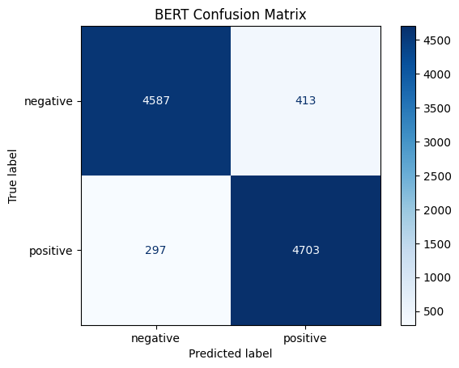
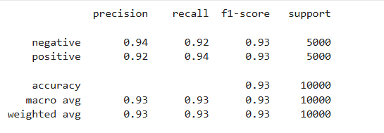

# 🤖 IMDb Movie Review Sentiment Analysis using BERT


This project demonstrates sentiment analysis on the IMDb Movie Reviews dataset using **BERT (Bidirectional Encoder Representations from Transformers)**.

Instead of relying on handcrafted preprocessing and feature engineering, the project fine-tunes Google's pre-trained **bert-base-uncased** model using the Hugging Face Transformers library. By leveraging transfer learning, the model learns contextual representations of text, enabling accurate sentiment classification with minimal preprocessing.

The notebook covers the complete workflow, including dataset preparation, tokenization, model fine-tuning, evaluation, prediction on unseen reviews, and model persistence for future inference.

---


## ✨ Features

- End-to-end BERT sentiment analysis pipeline
- Minimal text preprocessing
- Label encoding
- WordPiece tokenization
- Hugging Face Dataset integration
- Fine-tuning of bert-base-uncased
- Training using Hugging Face Trainer API
- Accuracy, Precision, Recall and F1 evaluation
- Confusion Matrix visualization
- Prediction on unseen movie reviews
- Save and reload trained models


---

# 📊 Dataset

The project uses the **IMDb Movie Reviews Dataset**, containing **50,000** labeled movie reviews equally divided into positive and negative sentiments.

| Attribute | Details |
|-----------|---------|
| Dataset | IMDb Movie Reviews |
| Total Reviews | 50,000 |
| Classes | Positive, Negative |
| Class Distribution | Balanced (25,000 each) |
| Task | Binary Text Classification |

The balanced nature of the dataset makes it an excellent benchmark for evaluating traditional NLP techniques.

---


# 🎯 Project Objectives

- Fine-tune a pre-trained BERT model for sentiment analysis.
- Understand the transformer-based NLP workflow.
- Learn tokenization using the Hugging Face ecosystem.
- Apply transfer learning to a real-world text classification problem.
- Evaluate model performance using multiple metrics.
- Save and reload trained models for future inference.


---

# 🧠 Why BERT?

Traditional NLP models rely on manually engineered features such as TF-IDF or Bag-of-Words.

BERT learns contextual representations directly from text using transformer-based self-attention, enabling the model to understand word meaning based on surrounding context.

This significantly reduces manual preprocessing while improving language understanding.

As a result, BERT has become one of the foundational transformer architectures for modern NLP tasks such as sentiment analysis, question answering, text classification, and named entity recognition.


---

# ⚙️ Project Workflow

```text
IMDb Reviews
      │
      ▼
Minimal Preprocessing
      │
      ▼
Label Encoding
      │
      ▼
Train-Test Split
      │
      ▼
Hugging Face Dataset
      │
      ▼
WordPiece Tokenization
      │
      ▼
Pre-trained BERT (bert-base-uncased)
      │
      ▼
Fine-Tuning
      │
      ▼
Evaluation
      │
      ▼
Save Model
      │
      ▼
Prediction
```

---

# 🛠️ Technologies Used

| Category | Technologies |
|----------|--------------|
| Programming Language | Python |
| Data Manipulation | Pandas, NumPy |
| Deep Learning Framework | PyTorch |
| Transformer Library | Hugging Face Transformers |
| Dataset Handling | Hugging Face Datasets |
| Tokenization | WordPiece Tokenizer |
| Model | BERT (bert-base-uncased) |
| Model Evaluation | Accuracy Score, Classification Report, Confusion Matrix |
| Visualization | Matplotlib |
| Development Environment | Google Colab, VS Code |


---

# 📈 Results

The fine-tuned **BERT (bert-base-uncased)** model achieved strong performance on the IMDb Movie Reviews dataset by leveraging contextual language understanding through transfer learning.

### Performance Summary

| Metric | Score |
|--------|-------|
| Accuracy | **92.90%** |
| Model | BERT (bert-base-uncased) |
| Framework | Hugging Face Transformers + PyTorch |

### Confusion Matrix

<p align="center">

</p>

### Classification Report

<p align="center">

</p>


---

# 📊 Evaluation Beyond Accuracy

Rather than relying solely on overall accuracy, the model is evaluated using multiple complementary performance metrics.

- **Accuracy** measures the overall prediction correctness.
- **Precision** evaluates the reliability of positive and negative predictions.
- **Recall** measures the model's ability to identify all relevant instances.
- **F1-score** balances Precision and Recall into a single metric.
- **Confusion Matrix** provides a detailed breakdown of correct predictions and classification errors.

Since the IMDb dataset is balanced, accuracy is an appropriate metric. However, combining these evaluation measures provides a more complete understanding of the model's performance.


---

# 🧠 Model Discussion

Unlike traditional machine learning models such as Logistic Regression, BERT does not provide directly interpretable feature coefficients.

Instead, it learns contextual language representations through multiple transformer layers and self-attention mechanisms, enabling a deeper understanding of word meaning based on surrounding context.

This project demonstrates the trade-off between interpretability and performance, where transformer models achieve richer language understanding at the cost of reduced transparency.


---

# 🔍 Key Learning Outcomes

Throughout this project, I explored not only how to fine-tune a transformer model but also how modern NLP differs from traditional machine learning approaches.

Key takeaways include:

- Understanding transfer learning in Natural Language Processing.
- Fine-tuning pre-trained transformer models using Hugging Face.
- Learning WordPiece tokenization and contextual embeddings.
- Evaluating transformer models beyond overall accuracy.
- Saving and reloading trained models for efficient inference.
- Building an end-to-end transformer-based sentiment analysis pipeline.


---

# 📂 Repository Structure

```text
Movie-Review-Sentiment-Analysis/
│
├── Dataset/
│   └── IMDB Dataset.csv
│
├── Notebook/
│   ├── 01_Classical_NLP/
│   │   ├── movie_review.ipynb
│   │   └── README.md
│   │
│   └── 02_BERT/
│       ├── movie_review_BERT.ipynb
│       └── README.md
│
├── images/
│   ├── Classical_NLP/
│   │    ├── Confusion_matrix.png
│   │    ├── Classification_report.png
│   │    └── Performance_table.png
│   │
│   └── BERT/
│       ├── Confusion_matrix.png
│       └── Classification_report.png
│
├── README.md
├── requirements.txt
├── .gitignore
└── LICENSE
```


---

# ⚙️ Installation

## Clone the repository

```bash
git clone https://github.com/ankith-b-kumar/IMBD-Movie-Reviews-Sentimental-Analysis-Classification-.git
cd Movie-Review-Sentiment-Analysis
```

## Install dependencies

```bash
pip install -r requirements.txt
```


---

# ▶️ How to Run

1. Clone the repository.
2. Install the required dependencies.
3. Open `movie_review_BERT.ipynb`.
4. Enable a GPU runtime if using Google Colab.
5. Set:

```python
USE_SAVED_MODEL = False
```

to train the model, or

```python
USE_SAVED_MODEL = True
```

to load a previously fine-tuned model.

6. Run all notebook cells sequentially.

The notebook includes:

- Dataset preparation
- Tokenization
- BERT fine-tuning
- Model evaluation
- Saving/loading the trained model
- Prediction on custom reviews


---

# 🚀 Future Improvements

Potential enhancements for this project include:

- Experiment with larger transformer models such as RoBERTa, DeBERTa, and DistilBERT.
- Perform hyperparameter optimization.
- Apply mixed precision training to improve efficiency.
- Explore explainability techniques such as SHAP or attention visualization.
- Deploy the fine-tuned model using Streamlit or Flask.


---

# 👨‍💻 Author

**B Ankith Kumar**

Computer Science Engineering (Data Science) Student

Interested in:

- Natural Language Processing (NLP)
- Machine Learning
- Data Analytics
- Generative AI

If you found this project helpful, consider giving it a ⭐ on GitHub.